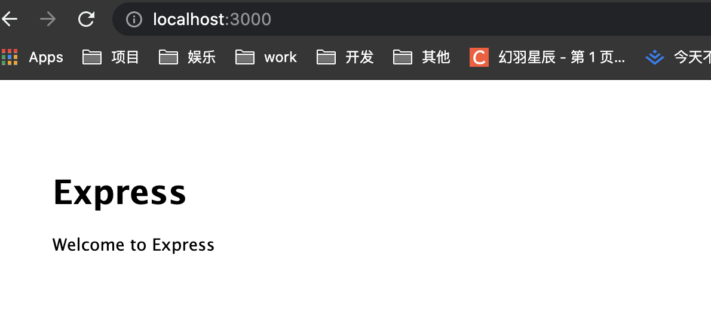
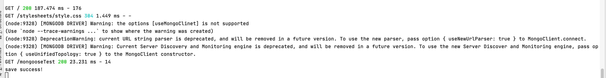
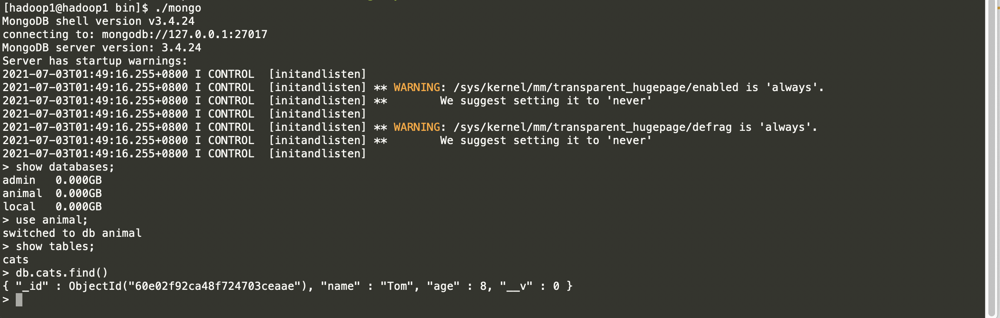
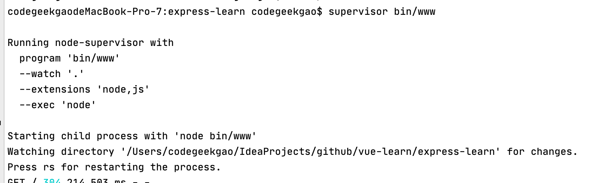

## express入门
- express 安装
```javascript
npm install express --save
```
- express-generator安装
```javascript
node install express-generator -g
```
- 使用express 快速创建项目
```javascript
# 创建express-learn项目
express express -learn
```
- 安装依赖并启动
```javascript
npm install && npm start
```
启动后显示如下：


- 使用中间件连接mongodb
```javascript
npm install mongoose --save
```

- 在index.js中添加路由并使用mongoose连接数据库
```javascript
router.get("/mongooseTest", (req, res, next) => {
  // 第一个参数用来指定连接数据库的url地址，第二个是连接配置的Javascript对象
  mongoose.connect("mongodb://10.211.55.9/animal", {useNewUrlParser: true})
  mongoose.Promise = global.Promise
  // 使用model方法传入名称和结构用来创建数据集(类似与创建了一个Cat类并指定该类的属性)
  const Cat = mongoose.model('Cat',{name:String,age:Number})
  // 实例化对象
  const tom = new Cat({name:'Tom',age:8})
  tom.save(error=> {
    if(error) {
      console.log('save failed')
    } else{
      console.log('save success！')
    }
  })
  res.send('mongoose test!')
})
```
控制台输出如下：


- mongodb查询插入数据
进入mongodb的bin目录下执行mogo脚本

可以在最后看到我们刚刚插入的数据tom

- 使用supervisor监控代码修改
如果在开发中进行修改代码，频繁的启动和终止程序是一个非常麻烦的事情。这里借助中间件supervisor启动程序并实现热部署
```javascript
npm install supervisor -g
```
终止刚刚的npm start 服务使用supervisor启动express项目
```javascript
supervisor bin/www
```


- express路由机制
express项目入口的文件是app.js，在此文件中定义了express对象,然后导入index.js与user.js
```javascript
var indexRouter = require('./routes/index');
var usersRouter = require('./routes/users');
var app = express();
app.use('/', indexRouter);
// user.js访问的API均为http://localhost:3000/users开头
app.use('/users', usersRouter);
```
将刚刚访问mongodb的代码做抽取为mongodbtest.js如下所示：
```javascript
var express = require('express');
var router = express.Router();
// 引入mongoose
const mongoose = require('mongoose')
router.get("/mongoose", (req, res, next) => {
    // 第一个参数用来指定连接数据库的url地址，第二个是连接配置的Javascript对象
    mongoose.connect("mongodb://10.211.55.9/animal", {useNewUrlParser: true})
    mongoose.Promise = global.Promise
    // 使用model方法传入名称和结构用来创建数据集(类似与创建了一个Cat类并指定该类的属性)
    const Cat = mongoose.model('Cat',{name:String,age:Number})
    // 实例化对象
    const tom = new Cat({name:'michael',age:24})
    tom.save(error=> {
        if(error) {
            console.log('save failed')
        } else{
            console.log('save success！',tom)
        }
    })
    res.send('mongoose test!')
})
module.exports = router;
```
在app.js引入上面这个js
```javascript
let mongooseRouter = require('./routes/mongotest')
app.use('/mongoose',mongooseRouter)
```
页面访问地址：http://localhost:3000/mongoose/mongoose,需要注意的是app.user的第一个参数与mongobtest.js定义的router.get的
第一个参数需要进行拼接
- 提取mongoose为公共组件db.js
```javascript
const mongoose = require('mongoose')
mongoose.connect('mongod://10.211.55.9/movieStar')
module.exports=mongoose
```
创建User.js
```javascript
let mongoose = require('../common/db')
let user = new mongoose.Schema({
    username: String,
    password: String,
    userMail: String,
    userPhone: String,
    userAdmin: Boolean,
    userPower: Number,
    userStop: Boolean
})
// 查询所有用户
user.statics.findAll = function (callback) {
    this.find({}, callback)
}
// 根据用户名查询
user.statics.findByUserName= function (username,callback)  {
    this.find({username: username}, callback)
}

//用户登录
user.statics.login= function(username,password,callback)  {
    this.find({username: username, password: password, userStop: false}, callback)
}
// 找回密码
user.statics.findUserPassword=function(username,phone,mail,callback)  {
    this.find({username: username, userPhone: phone, userMail: mail}, callback)
}
let userModel = mongoose.model('user', user)
module.exports = userModel
```
- 在新的router下user.js中定义注册方法：
```javascript
const user =require('../model/user')
router.post('/register',(req,res,next)=>{
  // 判断姓名、密码、邮箱、手机不能为空
  if(!req.body.username) {
    res.json({status:0,message:'用户名不能为空'})
  }
  if(!req.body.password) {
    res.json({status:0,message:'密码不能为空'})
  }
  if(!req.body.userMail){
    res.json({status:0,message:'邮箱不能为空'})
  }
  if(!req.body.userPhone){
    res.json({status:0,message:'电话不能为空'})
  }
  user.findByUserName(req.body.username,(error,userSave)=> {
      if(userSave.length!==0) {
          res.json({status:0,message:'用户名已存在'})
      } else {
          const registerUser = new user({
              username:req.body.username,
              password:req.body.password,
              userMail:req.body.userMail,
              userPhone:req.body.userPhone,
              userAdmin:false,
              userPower:false,
              userStop:false,
          })
        registerUser.save(()=> {
            res.json({status:0,message:'注册成功'})
        })
      }
  })
} )
```
- 安装crypto
```javascript
npm install crypto
```
提取加密Md5方法：
```javascript
let crypto = require('crypto')

 const getMD5=  function getMD5(id) {
    const md5 = crypto.createHash('md5')
    const token_before = id + '123456'
    return md5.update(token_before).digest('hex')
}
module.exports = getMD5
```
在登录的方法中调用此方法即可：
```javascript
// 登录
router.post("/login",(req,res,next)=> {
    // 判断姓名、密码、邮箱、手机不能为空
    if(!req.body.username) {
        res.json({status:0,message:'用户名不能为空'})
    }
    if(!req.body.password) {
        res.json({status:0,message:'密码不能为空'})
    }
    user.login(req.body.username,req.body.password,(error,userSave)=>{
        if(userSave.length!==0) {
           const generateMd5= md5(userSave[0].id)
            res.json({status:1, data: {message:'登录成功',token:generateMd5,user:userSave}})
        } else {
            res.json({status:0,message:'用户名或密码错误'})
        }
    })
})
```


